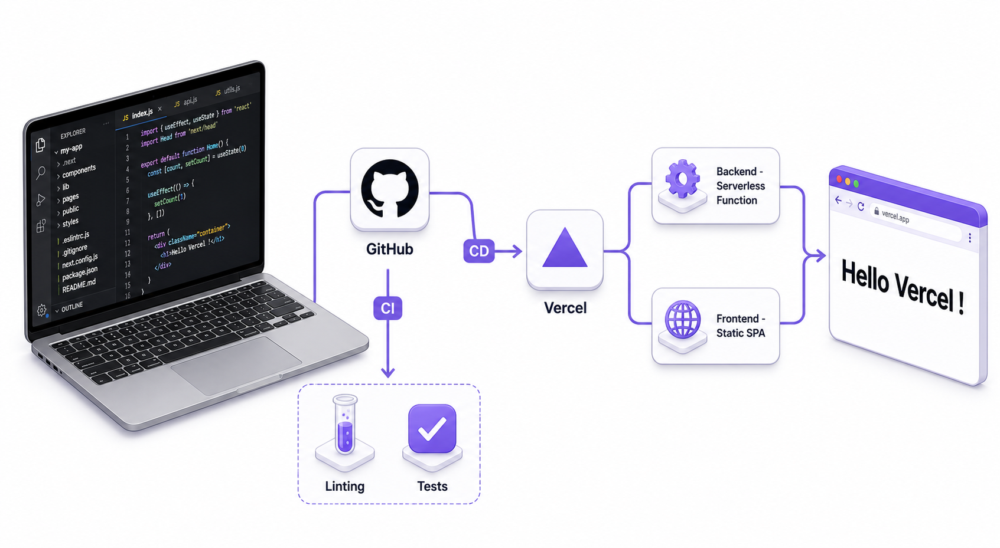

# Vercel Deploy Starter

A minimal full-stack web application (Node.js backend + React frontend) deployed to **Vercel** with **GitHub Actions CI/CD**.

Returns and displays: **Hello Vercel !**

---

##  Tech Stack

- **Backend:** Node.js, Express (deployed as a Vercel serverless function)
- **Frontend:** React (Vite, deployed as a static SPA)
- **CI/CD:** GitHub Actions
- **Hosting:** Vercel

---
##  Project Architecture


---
##  Project Structure

```tree
project-root/
│
├─ backend/                  # Node.js backend
│  ├─ package.json
│  ├─ vercel.json
│  └─ src/app.js
│
├─ frontend/                 # React frontend
│  ├─ package.json
│  ├─ vercel.json
│  ├─ vite.config.js
│  ├─ index.html
│  └─ src/
│     ├─ index.jsx
│     └─ App.jsx
│
├─ .github/workflows/        # CI/CD pipelines
│  ├─ CI.yaml
│  └─ CD.yaml
│
└─ README.md
```
---
## 🧠 What Concepts Every New Contributor Should Understand

| Concept | Plain English Explanation | Why It Matters Here |
|---------|--------------------------|--------------------|
| **Git & GitHub** | How you save and share code with others (`push`, `pull`, `commit`) | Essential for all open-source projects |
| **npm / dependencies** | Libraries like React, Express — you list them in `package.json` so everyone installs the same stuff | Keeps your app working across machines |
| **Vercel deployment** | Static frontend + serverless backend on one platform | No need to manage servers yourself |
| **.env files** | Local environment variables (API keys) never committed to GitHub | Prevents secrets leaking publicly |
| **CI/CD pipelines** | Automated testing and deploying when you push code | Saves time, catches mistakes early |

---

##  Getting Started (Local Dev)
### Clone the repo:

```bash
git clone https://github.com/fnywayz/vercel-deploy-starter.git
cd vercel-deploy-starter
``` 
### Backend
```bash
cd backend
npm install
npm run start
```

API endpoint: `GET http://localhost:3000/api/hello` → `{"message":"Hello Vercel !"}`

### Frontend

```bash
cd frontend
npm install
npm run dev
```

Runs on http://localhost:5173 and displays **Hello Vercel !**

---

##  CI/CD Pipeline

- **CI pipeline:** `.github/workflows/CI.yaml`
  Runs on every push and PR to `main`. Installs dependencies, lints, runs tests, builds frontend.
- **CD pipeline:** `.github/workflows/CD.yaml`
  Runs automatically after CI succeeds. Deploys backend and frontend to Vercel (production).

---

##  Deployment

- Vercel hosts the backend as a serverless Node.js function (`@vercel/node`)
- Vercel hosts the frontend as a static SPA
- Required GitHub secret: `VERCEL_TOKEN` (created at https://vercel.com/account/tokens)
- Link each project directory (`backend/` and `frontend/`) to its own Vercel project before the first deploy

---

##  Use This as a Template

Want to deploy your own app using this project as a starting point? Check **[README-universe.md](README-universe.md)** for a step-by-step guide on how to fork, customize, and host a similar web app.

### Example Apps You Can Build With This Template

| Stack | Backend | Frontend | Example Use Case |
|-------|---------|----------|------------------|
| **Node + React** | Express | React (Vite) | REST API + SPA dashboard *(this repo)* |
| **Node + Vue** | Express | Vue (Vite) | Portfolio site + API |
| **Node + Svelte** | Express | SvelteKit | Real-time chat app |
| **Node + Tailwind** | Express | Plain HTML + Tailwind | Landing page + backend |
| **Python + React** | Flask | React (Vite) | ML model API + frontend |
| **Python + Vue** | Django | Vue (Vite) | Blog platform + API |
| **Java + React** | Spring Boot | React (Vite) | Enterprise CRUD app |
| **Go + React** | Gin / Echo | React (Vite) | High-performance API |
| **Rust + React** | Actix / Axum | React (Vite) | Systems-level backend + SPA |

> **Note:** For Python/Java/Go/Rust backends, replace `@vercel/node` in `backend/vercel.json` with the appropriate Vercel runtime or use a separate hosting service for the backend.

---
## License

This project is licensed under the MIT License - see the [LICENSE](LICENSE) file for details.

You are free to:
- ✅ Use this project for any purpose
- ✅ Copy, modify, and distribute
- ✅ Use it commercially
- ⚠️ Just include the original license and copyright notice
